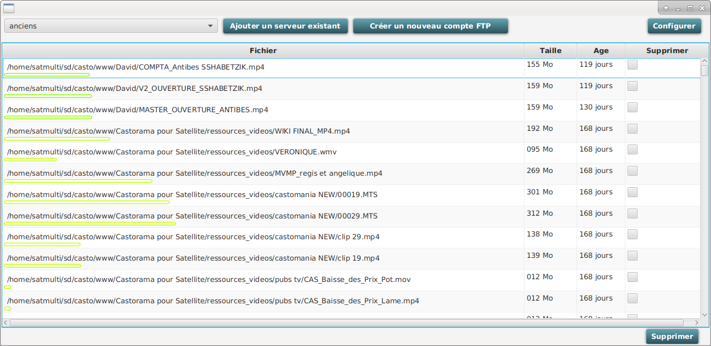
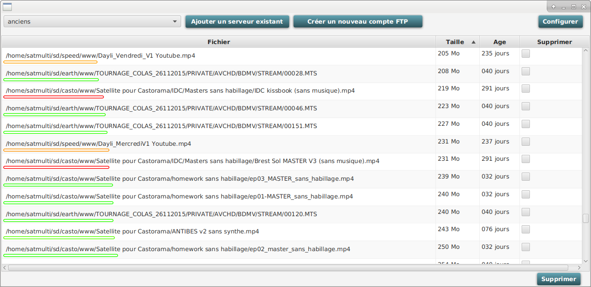
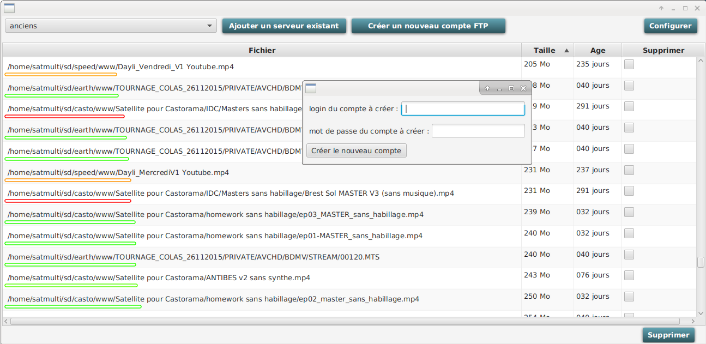

# FTP_status
*Give an another view on  a FTP tree : show &amp; sort age/size of files on a FTP dir&amp;sub-dirs without care of depth (javaFX)*

####Interface affichant une vue différente du contenu de l'arborescence d'un FTP :

- la vue applatie permet de voir tous les fichiers sans avoir besoin d'ouvrir les dossiers

- on peut les classer par nom, par taille ou par âge (afin de chercher rapidement les fichiers les plus vieux et les plus encombrants).

- la demande de suppression par cette interface autorise un délai de grâce configurable (défaut = une semaine)

- l'interface permet à l'utilisteur de créer à la volée, dans son espace, des comptes invités et autonomes

####Classement des fichiers par âge

####Classement des fichiers par taille

####Création d'un nouveau compte invité

